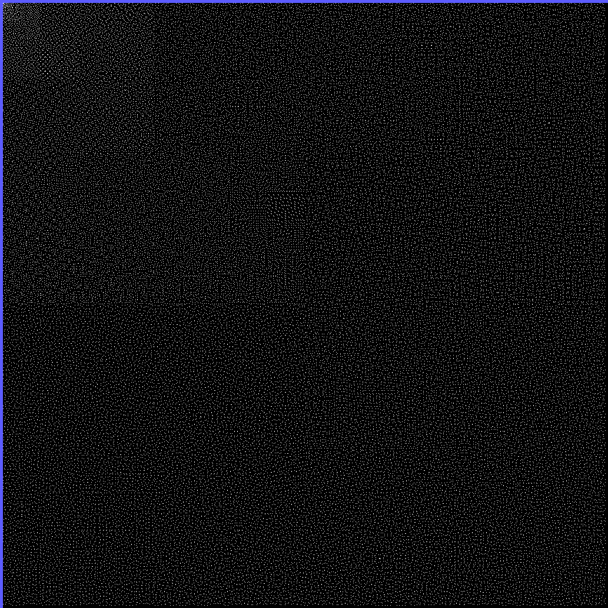
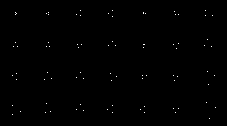
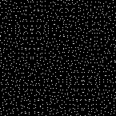

# π(x)

## A number theoretical function allows striking visualization

The original prime visualization project repo'd [here](https://github.com/xleph/HilbertPrimes) follows a narrow train of thought. It was my expectation that patterned adjacencies would arise in the process of formatting prime numbers to a Hilbert curve presentation. In fact, this is ultimately unsurprising, given the existence of spokes on the Ulam spiral. Hilbert curves are, however, a flavor of prime density different from the prime-rich polynomials that are described by the Ulam spiral.

Narrow expectations and vision aside, there was yet still to explore. Many approximations exist for the *n*th prime, formulations related to the Zeta function exist, formulations leveraging clever techniques related to factorials are also acknowledged, albeit not discussed. 

## The formal approximation

is ineffably useful and impactful in its simplicity. This expression falls naturally out of an understanding that, within the exact formulation of π(x) (namely the one given in the below source) is a summation of Li(xρ)'s which is in fact asymptotic to x/ln(x). What we have above is several tiers removed from any rigorous process of derivation, and yet, is usually presented as a standalone awe-inspiring formula.

I would argue from a pedagogical standpoint, the clear and total force of the above asymptotic relation can really only be felt in the presence of:

Considering that all of the above still do not fully realize the mode of discovery for π(x), it is still a worthy pursuit to state them in tandem, because of their value in computation.

[Source](deadlink)

## What the approximation tells us

As can be seen, the presence of [Li(x)](https://en.wikipedia.org/wiki/Logarithmic_integral_function) is as foundational as x/ln(x). If one attempts a standard Taylor series for Li(x) they will not have much success, as Li(x) possesses a simple pole at x = 1. This would seem to doom the derivation of such a series to failure. Indeed, the procured summation from such an excersize contains terms that grow in the factorial of n. One would then have the mind to defer to one of the formula's due to Ramanujan or Hardy. Each of those formulas depend somewhat on Li(x)'s definition in terms of Ei(ln(x)).

Alas, but what if there were an easier way?

Padé approximants seem a good candidate for upgrading our divergent, Taylor-adjacent series. Indeed, it has been loosely shown that on whatever order a Taylor-adjacent series diverges, its respective Padé approximants appear to converge as quickly if not more quickly. This, however leads to some frustration in that the pole Li(x = 1) seems to duplicate itself nastily and present transient poles where there were none in the original definition.

This is all to say, that I was simply not going to putz around with calculating Li(x) when several expressions of interest were clearly available.

Namely, I wanted to inspect the individual terms in the Taylor-adjacent series that all looked something like:

## Highlights

# Deriving meaning from the images

## No meaning?

It is unclear whether the progression of 2^10 consecutive nonprime integers

## Equations of potential future relevance

